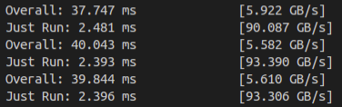
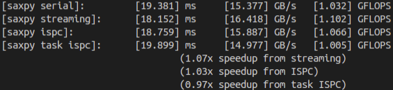
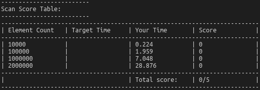
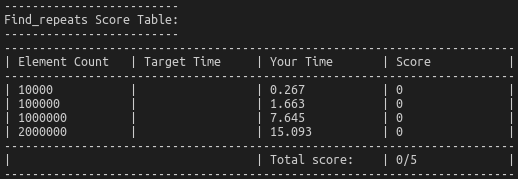

# Assignment 2 A Simple CUDA Renderer

[toc]

## 环境准备

Linux操作系统

CUDA-10.1

makefile内修改LDFLAGS

## Task 1 warm-up:saxpy

跟assignment 1的program5一样，但是用cuda来做。

要求很简单，添加cuda命令，使得数据从cpu传递到gpu，计算完成后从gpu传递到cpu，需要的函数为cudaMalloc() cudaMemcpy() cudaFree()，模仿官方手册的3.2.2的向量加法的例子容易完成任务。

然后通过获取时间计算速度，并与之前的assignment 1做一个对比

代码中计算了两个时间，一个是完整完成整个传递过程的时间Overall，一个是单纯的计算时间Just Run

每次连续运行3次，很奇怪，小概率出现整体速度变快一倍的现象，多数运行如下图

之前的任务中速度如下

可以看出，貌似GPU计算速度极快，但是数据的传递过程拖慢了整个过程。

要注意的是，如果不加入cudaThreadSynchronize()函数调用，由于cpu和gpu的运行是异步的，cpu将不等待gpu完成计算就返回时间

> https://blog.csdn.net/TH_NUM/article/details/82983282

### 问题

GPU的表现和宣称的速度一致吗？

官网给出的数据显示GTX 1650 sUPER 的内存带宽为192GB/s，这个速度在实验中只有小概率出现

## 2 Task 2 warm-up:并行前缀和

**scan**

寻找一个数列中所有满足A[i]=A[i+1]的下标i的函数的并行实现，即相邻两个数字一样的情况

要实现这个首先要实现并行计算前缀和

对于一个数组A的output数组，output[i]的含义是不包含A[i]的前面所有元素的和，output[0]=0，这种前缀和计算被称为exclusive scan

实现的算法为work-efficient算法，算法分为两个部分，正向的变增步长扫描与反向的变减步长扫描，这个过程中元素的加和互不冲突，可以容易得被设计为并行计算过程，但因为涉及到的中间数组是共享的，在读写的时候仍然会有bank conflict，因此这个算法可以通过计算偏移避免冲突进一步加速

**这个算法的可处理的数组长度受限于共享中间数组长度**，因此添加一个add函数，计算每个block的结果后，再将每个block中的结果加上前面block的总值

下面是运行结果（因为调用的是cuda8.0的api与机器上的不匹配，所以只有一个运行时间没有得分）

**find_repeats**

实现扫描算法后，再借助这个算法实现查重

首先实现一个并行的标记重复对的标记算法，如果这一位与下一位元素相同，标记为1否则为0

然后对标记数组进行扫描计算前缀和

接下来查找前缀和变化的位置，就是相同元素出现的位置，放入输出数组

但是这个实现存在的问题是希望用并行的方法进行加速，但我在输出结果数组长度的时候还是使用了线性扫描所以整体复杂度还是O(n):sweat_smile:

但不知道为什么还是很快:grin:

> 参考：https://github.com/DongyangY/ParallelProgramming/tree/master/prefix-sum-cuda
>
> https://www.eecs.umich.edu/courses/eecs570/hw/parprefix.pdf

## 3 Task 3 A Simple Circle Renderer

先略，以后有时间再搞

